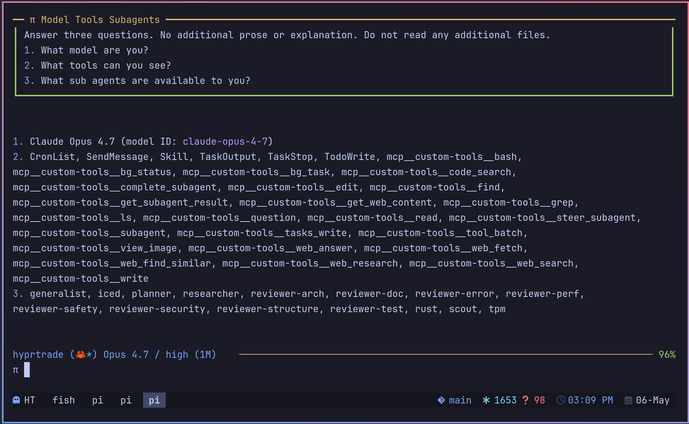

# pi-claude-bridge

A Pi provider that uses a logged-in Claude Code account through the Claude Agent SDK. You keep Pi's terminal interface and tools while Claude Code handles model requests.

Requires Pi 0.86.0 or later.

This is a private copy of the bridge in [w-winter/dot314](https://github.com/w-winter/dot314/tree/main/extensions/pi-claude-bridge), which forks [vanillagreen's `@vanillagreen/pi-claude-bridge`](https://github.com/vanillagreencom/kendex/tree/main/pi-extensions/pi-claude-bridge), itself a fork of [Eli Dickinson's `pi-claude-bridge`](https://github.com/elidickinson/pi-claude-bridge). It adds the fixes from [w-winter/dot314#20](https://github.com/w-winter/dot314/pull/20), which keep the Claude session the bridge rebuilds in sync with Pi's history.



## How it works

Pi keeps the terminal, the tools and the conversation history. Claude Code does the thinking. The bridge sits between them as a Pi model provider: it turns each Pi model request into a Claude Code query, and turns Claude Code's reply back into Pi's text, thinking and tool calls.

### The pieces

```
┌─ Pi ──────────────────────────────────────────────────────────────────┐
│                                                                       │
│   Pi's agent loop                  ┌────────────────────────────────┐ │
│   (TUI, tools, history)            │ pi-claude-bridge               │ │
│                                    │ a Pi model provider            │ │
│        model request ─────────────►│                                │ │
│                                    │ · builds the system prompt     │ │
│        text, tool calls ◄──────────│ · pairs each Pi session with   │ │
│                                    │   a Claude Code session        │ │
│                                    │ · offers Pi's tools to Claude  │ │
│                                    │   Code over MCP                │ │
│                                    └───────────────┬────────────────┘ │
└────────────────────────────────────────────────────┼──────────────────┘
                                                     │ Claude Agent SDK
┌─ claude  (Claude Code, a child process) ───────────▼──────────────────┐
│  signed in with your Claude account · its built-in tools are off      │
│  sees Pi's tools as mcp__custom-tools__read, …__bash, …               │
│  keeps its transcript under ~/.claude/projects/                       │
└────────────────────────────────────────────────────┬──────────────────┘
                                                     ▼
                                               Anthropic API
```

### One turn, with a tool call

```
                  Pi                      bridge                 Claude Code
                  │                         │                         │
 your prompt      ├── prompt ──────────────►│                         │
                  │                         ├── start or resume ─────►│
                  │◄── text, thinking ──────┤◄── streamed reply ──────┤
                  │◄── tool call: bash ─────┤◄── MCP call: bash ──────┤ waits
 Pi runs bash     │                         │                         │   ⋮
 (you may steer)  │                         │                         │   ⋮
                  ├── result (+ steer) ────►├── steer, then result ──►│ goes on
                  │◄── final text ──────────┤◄── rest of the reply ───┤
 reply done       │                         │                         │
```

One Claude Code query spans the whole turn. While Pi runs a tool, Claude Code is waiting on that MCP call, so nothing restarts between tool calls. A steering message you send meanwhile goes into the same query just before the tool result, and Claude's very next response sees both.

### The next turn: resume or rebuild

```
                          your next prompt
                                 │
                                 ▼
          does Claude Code's copy of the conversation still
          match Pi's history?   (checked with a digest)
                                 │
              ┌────── yes ───────┴─────── no ───────┐
              ▼                                     ▼
   ┌──────────────────────┐        ┌───────────────────────────────┐
   │ RESUME               │        │ REBUILD                       │
   │ send only the new    │        │ write Pi's history out as a   │
   │ messages; the prompt │        │ Claude Code transcript, then  │
   │ cache stays warm     │        │ resume from it                │
   └──────────────────────┘        └───────────────────────────────┘
                                    e.g. after /compact or /tree, or
                                    when another model took turns
```

The bridge saves which Claude Code session belongs to the Pi session in the Pi session file, so reopening a Pi session resumes the same Claude Code conversation. When Pi compacts or rewrites the history during a Pi tool call, the bridge restarts from Pi's new history with the completed tool results. A query that used one of Claude Code's own connectors finishes first, and the next turn uses Pi's new history.

## Install

Let Pi clone the repository and install its dependencies:

```bash
pi install git:git@github.com:nicobailon/pi-claude-bridge
```

To work on the bridge, clone it, run `npm install`, and add the folder's path to `packages` in `~/.pi/agent/settings.json`. Pi loads `src/index.ts` directly, so `/reload` picks up edits. To load it for one run, use `pi -e ./src/index.ts`.

A Claude Code login is required. Make `claude` available on `PATH` or set its executable path below.

Set `systemPrompt.replacement` in `claude-bridge.json` (see [Settings](#settings)) before the first request. Without it, the bridge refuses Pi's default main prompt.

Claude Sonnet 5.5 (`pi-claude/claude-sonnet-5-5`) requires [Claude Code 2.1.284 or later](https://github.com/anthropics/claude-code/blob/main/CHANGELOG.md#21284). Claude Opus 5.5 (`pi-claude/claude-opus-5-5`) requires [Claude Code 2.1.280 or later](https://github.com/anthropics/claude-code/blob/main/CHANGELOG.md#21280). Fable 5.1 requires [Claude Code 2.1.255 or later](https://code.claude.com/docs/en/model-config#work-with-fable). These requirements apply to an executable chosen through `provider.pathToClaudeCodeExecutable` or found on `PATH`, which takes precedence over the SDK's bundled CLI. Account access and usage-credit requirements still apply.

## Features

- Select Claude models from Pi's model menu, including `pi-claude/claude-opus-5-5` and `pi-claude/claude-fable-5-1`.
- Run Pi tool calls during Claude conversations.
- Steer Claude while a Pi tool runs.
- Resume the Claude conversation across Pi turns.
- Configure model effort and forwarded prompt context.
- Optionally use the Claude account's connectors.

## Settings

The bridge reads `claude-bridge.json` from `~/.pi/agent` and from a trusted project's `.pi/` directory. `PI_CODING_AGENT_DIR` changes the user directory. Run `/pi-claude` to show the provider's current status.

The bridge's `systemPrompt` configuration is independent of `anthropic-oauth-compat`, which continues to read `anthropicOAuthCompat` from `settings.json`.

- `enabled`: register the `pi-claude/*` models; reload required.
- `systemPrompt.replacement`: replace Pi's default base instructions in Pi's main agent prompt while retaining Pi's rules and guidelines (Pi's own rules, the selected tools' guidelines and extensions' `promptGuidelines`) and Pi-managed project context and skills. Pi's opening sentence, tool list and documentation pointers are dropped; Claude gets the tools as MCP definitions. When the session supplies its own base (`SYSTEM.md`, `--system-prompt`, an SDK `systemPrompt`, or a pi-subagents agent with `systemPromptMode: replace`), that base is kept: Claude receives the replacement, a blank line, then the complete prompt Pi built. Pi's default base is recognized by its fixed opening sentence ("You are an expert coding assistant operating inside pi, …"); a `before_agent_start` prompt that does not open with it is kept whole the same way. Other system prompts reach Claude unchanged, whatever they contain, including those of Pi's compaction and branch summaries and extensions' own model calls.
- `systemPrompt.includeModelLine`: prepend `Active model: provider/modelId` to the replacement.
- `systemPrompt.preservePiContext`: retain Pi-managed context after the replacement; defaults to `true`. `false` sends only the replacement in place of Pi's main agent prompt when that prompt has Pi's default base. A session's own base is never dropped, so with `false` it still arrives after the replacement together with its context.
- `provider.fastMode`, `provider.pathToClaudeCodeExecutable`: control how the Claude Code subprocess is launched.
- `provider.forceEffort`, `provider.modelEffortOverrides`: pin a Claude effort for every request or per model. Override keys are bare ids (`claude-opus-4-8`), `pi-claude/<id>` or `*`; values are `low`, `medium`, `high`, `xhigh` or `max`; a per-model entry beats the global force.
- `provider.settingSources`: explicitly load selected filesystem settings from Claude Code. By default, no settings load when connectors are disabled. When connectors are enabled, the bridge loads the user's settings.
- `provider.inheritAnthropicEnv`: `true` passes `ANTHROPIC_BASE_URL`, `ANTHROPIC_API_KEY` and `ANTHROPIC_AUTH_TOKEN` from the environment to Claude Code, for an intentional gateway or API-key setup. By default the bridge removes them, so an exported variable cannot route subscription requests through another endpoint or credential, and it does not count them as credentials when deciding whether the provider is connected. Only the user `claude-bridge.json` can set it, and managed account profiles never inherit these variables.
- `incidents.repo`: a GitHub `owner/name` that bridge incidents belong to. Setting it lets the bridge write its incidents to `claude-bridge-incidents.jsonl` in the Pi agent directory (metadata only, mode 0600), and lets the agent file an incident with the `claude_bridge_incident` tool. The bridge never files one on its own. The agent files an incident when it looks like a bridge bug, as an issue in that repository with the `gh` CLI (which must be installed and logged in), or as a comment on the open issue already filed for it, with its own summary of what happened. It then tells you which issue it filed. The session where an incident happened is told about it once, in a short message on its next turn (at most three per session). Only the user `claude-bridge.json` can set it; a project's value is ignored, and a value that is not `owner/name` is dropped. Unset, nothing about incidents is written to disk or filed and no notice is sent; the tool still lists and shows incidents, and refuses to file.

Without a `systemPrompt.replacement`, Pi's default main prompt is refused with a Pi error, and no Claude request is made. Its documentation section names both `docs/custom-provider.md` and `docs/packages.md`. Anthropic treats a subscription request whose system prompt contains both as a third-party app: it is billed to Extra Usage, or rejected with HTTP 400 when the account has no Extra Usage credit. The bridge refuses any request whose system prompt contains both paths. That covers pi-subagents children in append mode and extension calls that copy Pi's full system prompt. A replacement drops Pi's documentation section from the main prompt.

Example `claude-bridge.json`:

```json
{
  "systemPrompt": {
    "replacement": "You are Claude Code, Anthropic's official CLI for Claude.",
    "includeModelLine": true,
    "preservePiContext": true
  }
}
```

Environment variables:

- `CLAUDE_BRIDGE_STREAM_IDLE_TIMEOUT` (default 90s): how long Claude Code may stay silent during a turn, before or after its first output, while no Pi tool call is outstanding; bare numbers are seconds, `ms`, `s` and `m` suffixes are accepted, `0` disables.
- `CLAUDE_BRIDGE_DEBUG=1`: write the bridge log, the integrity diagnostics and per-query Claude Code CLI logs under the Pi agent directory; `CLAUDE_BRIDGE_DEBUG_PATH` and `CLAUDE_BRIDGE_DIAG_PATH` move the two log files. Without it, only the incidents file of `incidents.repo` is ever written.

Tool-result integrity problems always surface as a Pi error notification plus a metadata-only `claude-bridge-integrity` entry in the Pi session file, so a lost tool result can be analysed from the session alone.

Every anomaly the bridge detects becomes an incident with a short id such as `bi-7f3a`. An error text the bridge writes for Claude or Pi ends with ` (incident bi-7f3a)`. `/pi-claude incidents` lists this process's incidents, and `/pi-claude incidents <id>` shows one with its versions, metadata and the event order that led to it.

Maintainer notes and the test suites are in [DEVELOPMENT.md](DEVELOPMENT.md).

## Differences from upstream

- Sends Pi's system prompt, including project instructions, skills and extension context, on every request. With a `systemPrompt.replacement`, Pi's opening sentence, tool list and documentation section are swapped for the replacement. A system prompt that contains both of Pi's `docs/custom-provider.md` and `docs/packages.md` paths is refused, not sent (see Settings). Claude Code applies changes to the prompt on resumed turns.
- Reads the fork's `systemPrompt` settings from `claude-bridge.json`. A trusted project's settings override user settings and can replace the base prompt or add an active-model line.
- Registers Claude Opus 5.5 and Claude Sonnet 5.5 in Pi's model menu.
- Uses strict MCP configuration on every query. Connector sessions load the user's Claude Code settings by default; `provider.settingSources` overrides the setting sources.

Claude Code built-in tools are disabled by default, and Pi exposes its tools through MCP. The SDK may prepend its own identity text to the custom prompt.

## Connectors

Connectors are disabled by default. Set `provider.enableConnectors` in the user `claude-bridge.json`, or set the `CLAUDE_BRIDGE_ENABLE_CONNECTORS` environment variable. Project configuration cannot enable them.

Connector access is read-only by default. For a dedicated process running an approved write, set `CLAUDE_BRIDGE_CONNECTOR_WRITE=allow`; keep `allow` out of persistent `provider.connectorWriteMode` configuration. Use `/pi-claude:connectors` to list the account's connectors.

With connectors enabled, Claude Code loads user settings. An explicit `provider.settingSources` list in `claude-bridge.json` changes that selection. Including project or local settings lets those files affect the subprocess.
