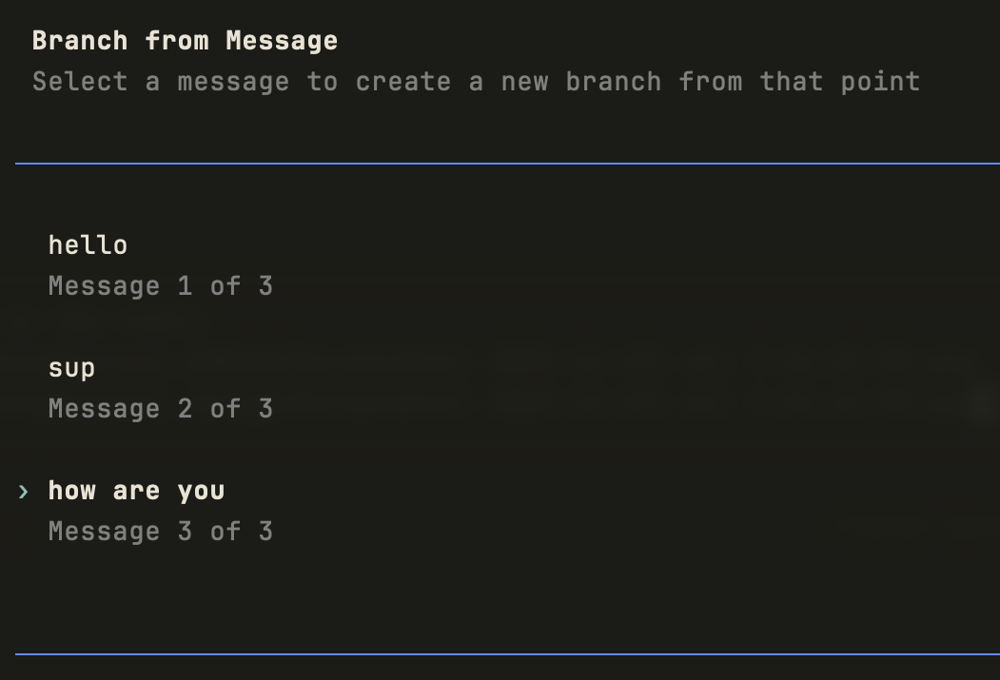
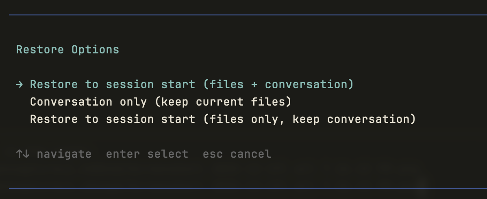

# Rewind Extension

> **Archived.** This fork's session-native rewrite has been adopted upstream into [nicobailon/pi-rewind-hook](https://github.com/nicobailon/pi-rewind-hook).  Install that version with `pi install npm:pi-rewind-hook`.
>
> Reference: [`dot314@b432676`](https://github.com/w-winter/dot314/commit/b43267682059a4b7c37d557b608e8413ecbd0298) -> [`pi-rewind-hook@0c08de4`](https://github.com/nicobailon/pi-rewind-hook/commit/0c08de48228468fc09f46567bdc95ee14a592635).

---

A Pi agent extension that records exact file-state rewind points, allowing restoration of file states during `/tree` navigation and across resumed and forked sessions

Rewind metadata lives in the session itself as hidden entries, so rewind history survives across forks, resumes, tree navigation, and compaction. Snapshot commits are kept reachable through a single git ref rather than one ref per checkpoint, and rewind points can be resolved across session lineage via `parentSession` links. Retention is optional and configurable; without it, exact history is kept indefinitely.

## Screenshots





## Requirements

- Pi agent v0.35.0+
- Node.js (for installation)
- Git repository

## Installation

```bash
npx pi-rewind-hook
```

This will:
1. Create `~/.pi/agent/extensions/rewind/`
2. Download the extension files
3. Add the extension to your `~/.pi/agent/settings.json`
4. Migrate any existing hooks config to extensions (if upgrading from an older version)
5. Clean up old `hooks/rewind` directory (if present)

Or clone the repo into `~/.pi/agent/extensions/rewind/` — Pi discovers extensions in that directory automatically.

## Configuration

Optionally add settings to `~/.pi/agent/settings.json`.  For example:

```json
{
  "rewind": {
    "silentCheckpoints": true,
    "retention": {
      "maxSnapshots": 2000,
      "maxAgeDays": 30,
      "pinLabeledEntries": true
    }
  }
}
```

### Settings

- `rewind.silentCheckpoints` — hides footer/status and checkpoint notifications
- `rewind.retention.maxSnapshots` — optional cap on unpinned unique snapshot commits kept reachable
- `rewind.retention.maxAgeDays` — optional age limit for unpinned snapshot commits
- `rewind.retention.pinLabeledEntries` — when true, snapshot commits bound to **labeled nodes** in the Pi session tree are exempt from `maxSnapshots` and `maxAgeDays` pruning (useful for bookmarking important rewind points you want to prevent getting garbage-collected)

If `rewind.retention` is omitted, Rewind keeps exact history with no automatic expiration.

## Usage

### Rewinding via `/fork`

1. Type `/fork` in Pi
2. Select a message to branch from
3. Choose a restore option

**Options:**

| Option | Files | Conversation |
|--------|-------|-------------|
| **Conversation only (keep current files)** | Unchanged | Reset to that point |
| **Restore all (files + conversation)** | Restored | Reset to that point |
| **Code only (restore files, keep conversation)** | Restored | Unchanged |
| **Undo last file rewind** | Restored to before last rewind | Unchanged |

`Restore all`, `Code only`, and `Undo last file rewind` are only shown when an exact rewind point or undo snapshot is available for the selected message.

When you restore files during `/fork`, the undo snapshot is persisted in the **new child session**, because that is where you continue working.

### Rewinding via `/tree`

1. Press `Tab` to open the session tree
2. Navigate to a different node
3. Choose a restore option

**Options:**

| Option | Files | Conversation |
|--------|-------|-------------|
| **Keep current files** | Unchanged | Navigated to that point |
| **Restore files to that point** | Restored | Navigated to that point |
| **Undo last file rewind** | Restored to before last rewind | Navigated to that point |

If you navigate with `Keep current files`, Rewind still persists the resulting session position's exact current file baseline via `rewind-op.current`.

### Examples

**Undo a bad refactor:**

```
You: refactor the auth module to use JWT
Agent: [makes changes you don't like]

You: /fork
→ Select "refactor the auth module to use JWT"
→ Select "Code only (restore files, keep conversation)"

Result: Files restored, conversation intact. Try a different approach.
```

**Start fresh from an earlier point:**

```
You: /fork
→ Select an earlier message
→ Select "Restore all (files + conversation)"

Result: Both files and conversation reset to that point.
```

## How Rewind works

Rewind stores its ledger in hidden session `custom` entries:

- `rewind-turn` — one per prompt, containing the triggering user-node snapshot plus any assistant-node snapshots produced during that prompt
- `rewind-op` — sparse records for `/fork`, `/tree`, compaction aliases, summary aliases, and undo state

Snapshots are only considered at visible boundaries:

- the user pre-prompt boundary
- each assistant `turn_end`
- selected stateful session operations

Rewind does not create per-tool snapshots.

### Canonical exact rewind points

Exact file restore is available for:

- user nodes
- assistant nodes
- compaction nodes aliased to the current exact state
- branch-summary nodes aliased during `/tree`

Exact file restore is not offered for toolResult nodes.

### Git storage model

Snapshot commits are kept reachable through a single repo-local ref:

```text
refs/pi-rewind/store
```

That ref is only for git object reachability; the session ledger is authoritative.

### Deduplication

Before creating a snapshot commit, Rewind captures the worktree tree SHA. If it matches the latest exact snapshot tree, Rewind reuses that existing snapshot commit instead of creating a new one.

### Restore exactness and scope

Rewind restores the exact file state for the snapshot domain it owns:

- tracked files
- untracked, non-ignored files
- without staging the real git index during restore

Before restoring target contents, it deletes paths present in the current snapshot but absent from the target snapshot, then restores the target snapshot into the worktree only.

Out of scope:

- ignored files
- empty directories
- exact rewind points for `toolResult` nodes
- exact rewind points for `bashExecution` nodes

## Lineage and resume behavior

Rewind resolves exact rewind points across session lineage by following `parentSession` links and reading rewind metadata from ancestor session files.

Legacy checkpoint refs (from earlier versions) can be imported into the current session ledger for user nodes. Unscoped legacy refs are only considered for the current active session because ownership is ambiguous. Older histories gain exact user-node mappings through import; assistant-node exactness requires captures from the current version.

## Retention

Retention only affects git reachability. Session JSONL metadata is append-only and is never compacted by Rewind.

When retention is enabled, Rewind keeps snapshot commits alive if they are referenced by:

- a `rewind-turn` or `rewind-op` binding in a discovered same-repo session
- the latest `rewind-op.current` for a discovered same-repo session
- the latest `rewind-op.undo` for a discovered same-repo session
- a labeled bound entry when `pinLabeledEntries` is enabled

If a snapshot commit has been pruned, Rewind validates commit existence before offering restore.

If retention discovery yields an empty live set, Rewind preserves the existing `refs/pi-rewind/store` ref rather than deleting it.

## Viewing storage

Show the store ref head:

```bash
git rev-parse refs/pi-rewind/store
```

Show the hidden rewind ledger in a session file:

```bash
grep '"customType":"rewind-' ~/.pi/agent/sessions/**/*.jsonl
```

## Uninstalling

1. Remove the extension directory:
   ```bash
   rm -rf ~/.pi/agent/extensions/rewind
   ```

2. Remove any `rewind` key from `~/.pi/agent/settings.json` if you added one

3. Optionally, clean up the git reachability ref in each repo where you used the extension:
   ```bash
   git update-ref -d refs/pi-rewind/store
   ```

## Limitations

- Only works in git repositories
- Session metadata grows append-only; retention only trims git reachability
- Discovery for retention is best-effort across discovered Pi session roots and explicit `parentSession` ancestors
- Ignored files and empty directories are outside the snapshot model
